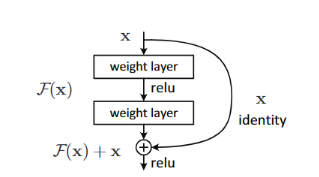

# 数据集介绍

CIFAR-100 数据集作为计算机视觉领域的经典基准数据集，包含 100 个类别、共 6 万张 32×32 的彩色图像，涵盖自然物体、人造物体等多类视觉场景。由于图像分辨率低、类别间差异细微且存在大量类内变异（如不同品种的动物、植物），其分类任务对模型的特征提取能力、泛化能力和细节分辨能力提出了较高要求。通过构建高效的神经网络模型实现 CIFAR-100 分类，能高效验证模型在复杂视觉任务中的有效性。

在python版本下：

数据集包含train、test和meta三个文件。
- train文件：包含训练集数据，是一个字典，包含以下键值对：
- - data：一个50000×3072的numpy数组，每行存储一个32×32彩色图像的像素值，前1024个条目为红色通道值，接下来1024个为绿色通道值，最后1024个为蓝色通道值。
- - fine_labels：一个长度为50000的列表，存储每个图像的细粒度标签。
- - coarse_labels：一个长度为50000的列表，存储每个图像的粗粒度标签。
- - filenames：一个长度为50000的列表，存储每个图像的文件名。
- - batch_label：存储批处理信息。
- test文件：包含测试集数据，结构与train文件类似，但数据量为10000。
- meta文件：包含数据集的元信息，是一个字典，包含以下键值对：
- - fine_label_names：一个长度为100的列表，存储每个细粒度类别的名称。
- - coarse_label_names：一个长度为20的列表，存储每个粗粒度类别的名称。

# Resnet

我们选择Resnet作为本次实验的baseline。ResNet的核心思想是引入残差学习来避免随着网络层数的增加，训练误差逐渐增大的“退化”问题。

在残差网络中，残差块通过将输入直接加到非线性变换的输出中，使得网络可以学习恒等映射。

- 输入 x 经过两个卷积层，得到 F(x)。
- F(x) 与输入 x 相加，即 x + F(x)。
- 最后的输出是 x + F(x)，这个输出被传递到下一个残差块。