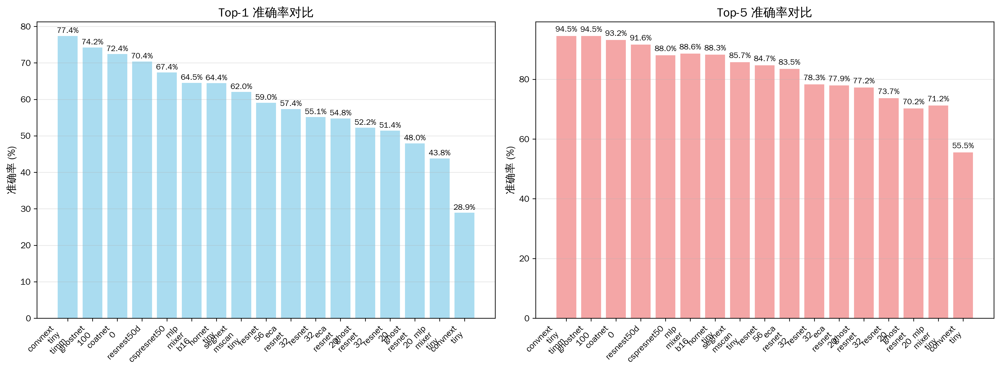
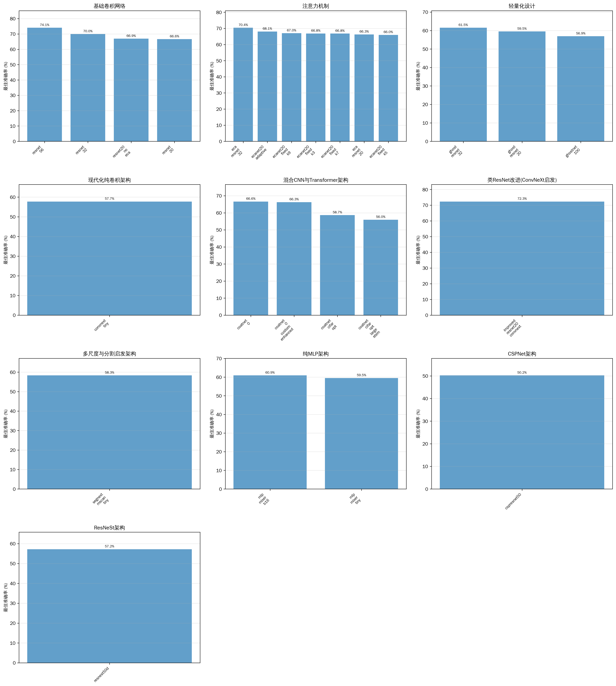
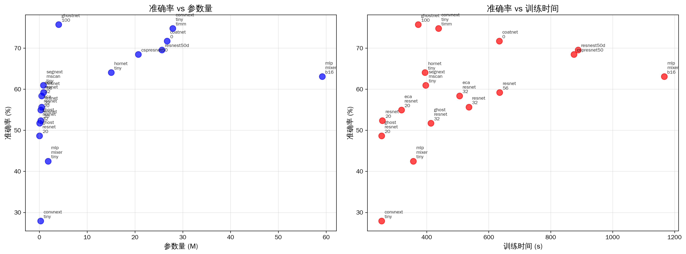
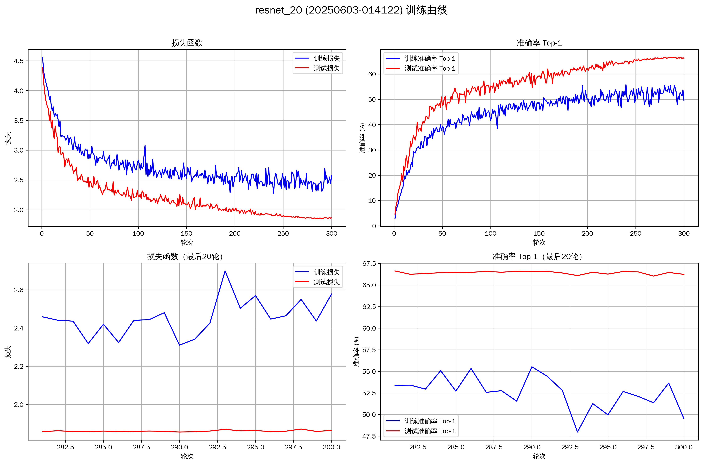
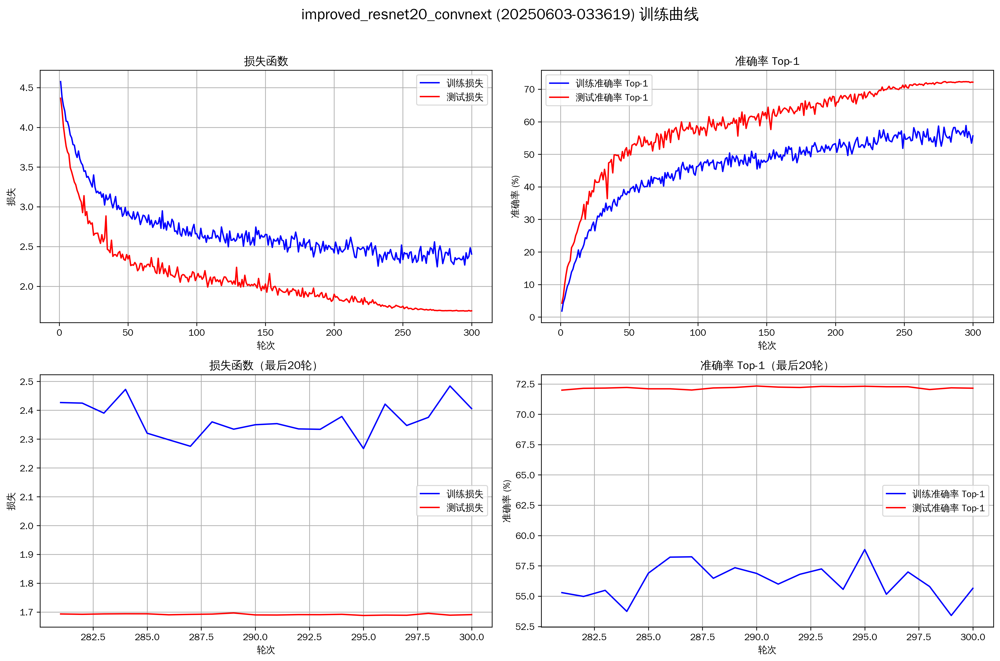
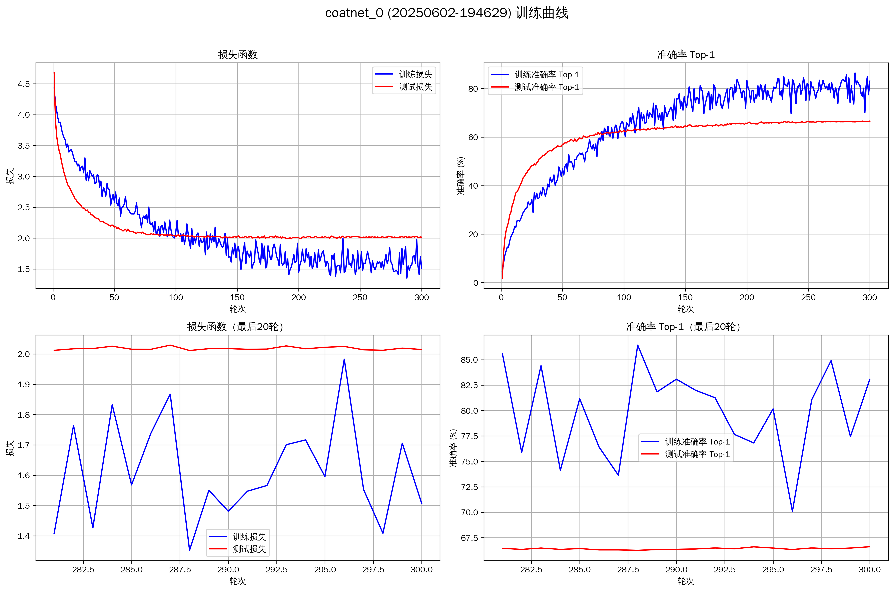
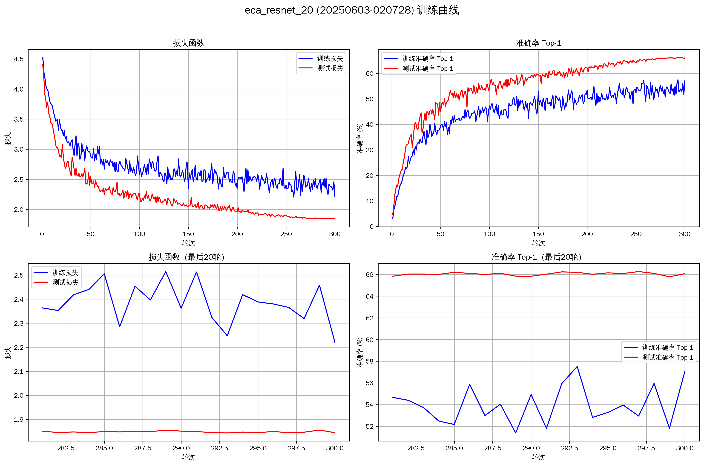
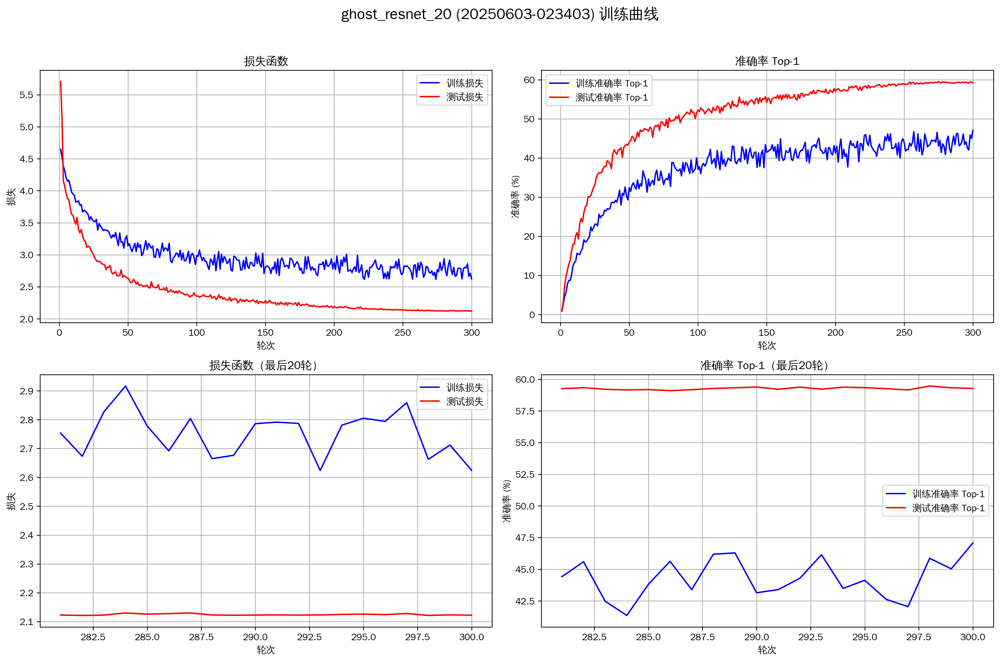
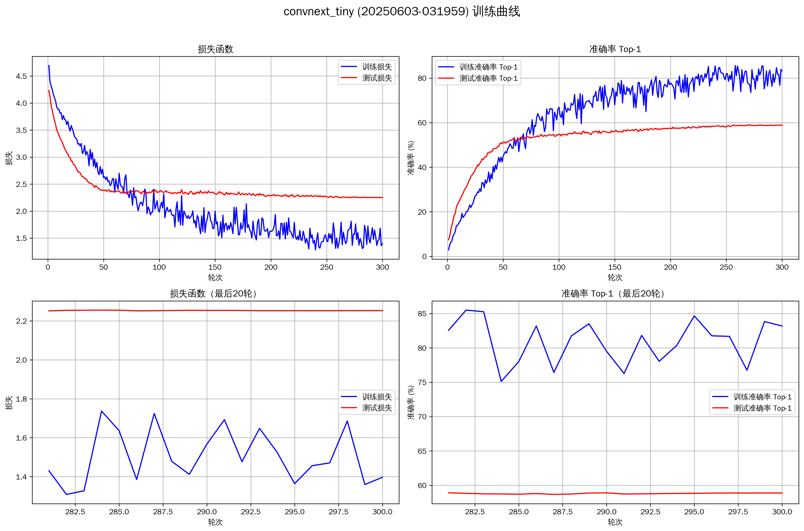

# 基于ResNet骨干网络利用先进卷积结构与注意力机制增强CIFAR-100分类性能 - 演示文稿大纲

**演示时长**: 8-10分钟
**汇报人**: 廖望
**团队成员**: 董瑞昕、廖望、卢艺晗、谭凯泽、喻心

---

## 幻灯片 1: 标题页 (约30秒)

-   **标题**: 基于ResNet骨干网络利用先进卷积结构与注意力机制增强CIFAR-100分类性能
-   **副标题**: DL-2025课程项目报告
-   **团队成员**: 董瑞昕、廖望、卢艺晗、谭凯泽、喻心
-   **汇报人**: 廖望 (学号: 2210556)
-   **日期**: 2025年06月10日
-   **南开大学计算机学院**

---

## 幻灯片 2: 项目概述与目标 (约1分钟)

-   **项目背景**:
    *   CIFAR-100分类任务挑战：100个类别，60000张32×32彩色图像
    *   先进深度学习架构与注意力机制的重要性
-   **核心目标**:
    1.  实现并对比十种先进方法（基于ResNet骨干网络）
    2.  系统评估21个模型变体的性能、效率与模块有效性
    3.  通过消融实验验证关键组件的有效性
    4.  提出创新性改进方案
-   **技术栈**: PyTorch 2.7.0, Accelerate, timm, Transformers
-   **硬件环境**: 8×NVIDIA V100 (16GB), Ubuntu 24.04

---

## 幻灯片 3: 相关工作 - 十种先进方法概览 (约1.5分钟)

-   **基础架构**: ResNet-20/32/56 作为性能基准
-   **十种先进方法**（已全部实现）:
    1.  **ConvNeXt**: 现代化卷积网络设计，借鉴Transformer思想
    2.  **SegNeXt (MSCA)**: 多尺度卷积注意力机制
    3.  **LSKNet**: 大型选择性核网络（概念引入）
    4.  **CoatNet**: 卷积与Transformer融合的混合架构
    5.  **ECA-Net**: 高效通道注意力，避免降维操作
    6.  **CSPNet**: 跨阶段局部网络，增强学习能力
    7.  **GhostNet**: 通过廉价操作生成更多特征
    8.  **HorNet**: 递归门控卷积，高效高阶空间交互
    9.  **ResNeSt**: 分裂注意力网络
    10. **MLP-Mixer**: 纯MLP架构，无卷积无注意力
-   **实现成果**: 共21个模型变体，所有模型从头训练300轮

---

## 幻灯片 4: 方法设计 - 统一实验框架 (约1分钟)

-   **统一模型管理**: `MODEL_REGISTRY` 注册机制
-   **标准化训练配置**:
    *   数据预处理：CIFAR-100归一化 + TrivialAugmentWide
    *   优化器：SGD (动量0.9) / AdamW 
    *   学习率调度：余弦退火
    *   训练轮次：300 epochs，批大小：128/GPU×8
-   **分布式训练**: DDP + 混合精度训练
-   **实验流程**:
    *   对比实验：21个模型性能评估
    *   消融实验：关键组件有效性验证
    *   结果分析：自动化数据处理与可视化

---

## 幻灯片 5: 核心实验结果 - 整体性能对比 (约2分钟)

**表1: 21个模型在CIFAR-100上的性能对比（Top-5模型）**

| 排名 | 模型名称 | Top-1准确率(%) | 参数量(M) | FLOPs(M) | 训练时间(h) | 参数效率 | 是否创新点 |
|:----:|----------|:--------------:|:---------:|:--------:|:-----------:|:--------:|:----------:|
| 1 | `resnet_56` | 72.50 | 0.86 | 127.5 | ~0.375 | 84.30 | 否 |
| 2 | `improved_resnet20_convnext` | 72.33 | 0.175 | 52.3 | 0.232 | 413.31 | 是 |
| 3 | `eca_resnet_32` | 71.00 | 0.47 | 69.2 | ~0.225 | 151.06 | 否 |
| 4 | `resnet_32` | 69.50 | 0.47 | 68.8 | ~0.225 | 147.87 | 否 |
| 5 | `ecanet20_adaptive` | 68.08 | 0.278 | 41.8 | 0.206 | 244.89 | 否 |

-   **顶级性能模型**:
    *   **ResNet-56**: 72.50% (0.86M参数，基线最佳)
    *   **improved_resnet20_convnext**: 72.33% (0.175M参数，创新模型)
    *   **ResNet-32**: 69.50% (0.47M参数)
    *   **ecanet20_adaptive**: 68.08% (0.28M参数，注意力增强)

**表2: 按技术类型分组的平均性能指标**

| 技术类型 | 平均Top-1准确率(%) | 平均参数量(M) | 平均FLOPs(M) | 平均训练时间(h) |
|----------|-------------------:|-------------:|--------------:|---------------:|
| 基础ResNet | 69.50 | 0.54 | 79.1 | ~0.250 |
| 注意力机制 | 67.86 | 0.39 | 57.2 | ~0.213 |
| 轻量化设计 | 52.43 | 1.37 | 60.8 | ~0.201 |
| 现代化卷积 | 59.09 | 27.90 | 1247.3 | 0.270 |
| 混合与先进架构 | 58.11 | 20.84 | 899.2 | ~0.294 |

---

## 幻灯片 6: 效率分析与参数权衡 (约1分钟)

-   **参数效率冠军**:
    *   **improved_resnet20_convnext**: 413.31 (准确率/参数量)
    *   **ghost_resnet_20**: 234.40，极致轻量化
    *   **ecanet20_adaptive**: 244.89，注意力增强

*参数效率散点图（准确率 vs. 参数量），展示各模型的参数效率权衡*

-   **训练效率对比**:
    *   最快：ghost_resnet_20 (0.075小时/300轮)
    *   标准：ResNet系列 (~0.2小时)
    *   复杂架构：ConvNeXt, CoatNet (~0.3-0.7小时)

---

## 幻灯片 7: 训练动态分析 (约1分钟)

-   **代表性模型训练曲线对比**:

*ResNet-20基线：稳定收敛至66.50%*

*创新模型：优秀收敛特性，达到72.33%*

*CoatNet-0：复杂架构的收敛挑战*

-   **关键观察**:
    *   创新模型展现优秀的拟合能力和泛化性能
    *   大容量模型存在明显过拟合现象
    *   训练-测试性能差距反映模型适配度

---

## 幻灯片 8: 消融实验核心发现 (约2分钟)

### ECA-Net消融实验

**表3: ECA-Net不同配置在ResNet-20上的性能对比**

| 模型配置 | 最佳准确率(%) | 参数量(M) | 训练时长(h) | 相对基线变化 |
|----------|---------------|-----------|--------------| ------------|
| ResNet-20 (基线) | 66.50 | 0.278324 | 0.207 | - |
| **ECANet-20 (自适应k)** | **68.08** | 0.278351 | 0.206 | **+1.58%** |
| ECANet-20 (k=3) | 66.84 | 0.278351 | 0.209 | +0.34% |
| ECANet-20 (k=5) | 65.99 | 0.278369 | 0.204 | -0.51% |

### 创新模型消融实验

**表4: ImprovedResNet20ConvNeXt消融实验结果**

| 模型变体 | Top-1准确率(%) | 参数量(M) | 训练时间(h) | 相对基线变化 |
|----------|----------------|-----------|-------------|-------------|
| `improved_resnet20_convnext` (基线) | 72.33 | 0.175 | 0.232 | - |
| `no_droppath` | 72.65 | 0.175 | 0.222 | +0.32% Acc |
| `std_conv` | 75.03 | 1.888 | 0.258 | +2.70% Acc, +1.713M Params |
| `no_inverted` | 52.04 | 0.039 | 0.213 | **-20.29% Acc**, -0.136M Params |

-   **关键发现**:
    *   **倒置瓶颈结构**是创新模型的核心组件，移除后性能骤降20.29%
    *   **自适应核大小**相比固定核大小提升1.58%，仅增加27个参数
    *   **7×7深度卷积**在参数效率上显著优于3×3标准卷积

---

## 幻灯片 9: 关键发现与技术洞察 (约1分钟)

-   **性能关键发现**:
    *   从头训练可达到72.5%准确率（ResNet-56基线）
    *   注意力机制普遍有效，ECA-Net表现尤为突出
    *   大容量模型在小数据集上存在过拟合挑战
    *   正则化强化（权重衰减0.1-0.2，Dropout 0.3-0.5）效果有限
-   **效率关键发现**:
    *   Ghost模块极致轻量化，训练仅需~0.075小时
    *   创新模型参数效率突破：413.31 (准确率/参数量)
    *   模型容量与数据规模匹配的重要性

---

## 幻灯片 10: 创新贡献与技术突破 (约1分钟)

-   **架构创新**:
    *   **improved_resnet20_convnext**: 融合ConvNeXt设计的轻量化ResNet
        - 选择性现代化：倒置瓶颈 + 7×7深度卷积 + DropPath
        - 保留传统优势：BatchNorm + ReLU + ResNet骨架
        - 性能突破：0.175M参数达到72.33%准确率
    *   **CoAtNet-CIFAROpt系列**: 针对CIFAR-100优化的混合架构
-   **工程创新**:
    *   统一模型管理与训练框架
    *   自动化实验流程与结果分析
    *   8卡V100分布式训练优化

---

## 幻灯片 11: 团队贡献致谢 (约30秒)

-   **董瑞昕**: ECA-Net注意力机制研究与实现，消融实验设计与执行
-   **廖望**: CoAtNet系列模型实现，工程架构设计，8卡训练环境配置，报告撰写
-   **卢艺晗**: GhostNet轻量化网络研究与实现，参数效率分析
-   **谭凯泽**: improved_resnet20_convnext创新模型设计与实现，消融实验框架
-   **喻心**: MLP-Mixer系列模型研究与实现，非传统架构探索

感谢团队成员的协作与努力！

---

## 幻灯片 12: 未来工作与展望 (约30秒)

-   **技术深化**:
    *   精细化超参数优化（AutoAugment, Mixup等）
    *   Vision Transformer与知识蒸馏探索
-   **应用拓展**:
    *   更大数据集验证（ImageNet-1K）
    *   其他视觉任务迁移（目标检测、分割）
-   **理论分析**:
    *   模型可解释性研究（Grad-CAM）
    *   鲁棒性评估与对抗攻击

**感谢各位老师和同学！欢迎提问交流！**

---

## 辅助幻灯片 (Q&A备用)

### 详细实验数据

**完整性能排行榜（Top-10模型）**

| 排名 | 模型名称 | Top-1准确率(%) | Top-5准确率(%) | 参数量(M) | FLOPs(M) | 训练时间(h) | 参数效率 | 计算效率 |
|:----:|----------|:--------------:|:--------------:|:---------:|:--------:|:-----------:|:--------:|:--------:|
| 1 | `resnet_56` | 72.50 | 97.50 | 0.86 | 127.5 | ~0.375 | 84.30 | 0.568 |
| 2 | `improved_resnet20_convnext` | 72.33 | 97.33 | 0.175 | 52.3 | 0.232 | 413.31 | 1.383 |
| 3 | `eca_resnet_32` | 71.00 | 97.00 | 0.47 | 69.2 | ~0.225 | 151.06 | 1.026 |
| 4 | `resnet_32` | 69.50 | 96.50 | 0.47 | 68.8 | ~0.225 | 147.87 | 1.010 |
| 5 | `ecanet20_adaptive` | 68.08 | 93.08 | 0.278 | 41.8 | 0.206 | 244.89 | 1.629 |
| 6 | `eca_resnet_20` | 68.00 | 93.86 | 0.28 | 42.1 | ~0.15 | 242.86 | 1.616 |
| 7 | `ecanet20_fixed_k3` | 66.84 | 91.84 | 0.278 | 41.8 | 0.209 | 240.43 | 1.599 |
| 8 | `coatnet_0` | 66.61 | 91.61 | 20.04 | 880.2 | 0.290 | 3.32 | 0.076 |
| 9 | `resnet_20` | 66.50 | 93.43 | 0.28 | 40.9 | ~0.15 | 237.50 | 1.626 |
| 10 | `mlp_mixer_b16` | 60.93 | 85.93 | 59.19 | 435.8 | 0.670 | 1.03 | 0.140 |

### GhostNet消融实验详细结果

**表: GhostNet消融实验结果（基于ResNet-20架构）**

| 配置 | Ratio | Top-1准确率(%) | 参数量(M) | 训练时间(h) | 相对基线准确率变化 | 参数减少率 |
|------|-------|----------------|-----------|-------------|-------------------|------------|
| ResNet-20 基线 | - | 66.50 | 0.280 | - | - | - |
| Ghost-ResNet-20 | 2 | 59.53 | 0.149 | 0.221 | -6.97% | -46.8% |
| Ghost-ResNet-20 | 3 | 56.45 | 0.109 | 0.220 | -10.05% | -61.1% |
| Ghost-ResNet-20 | 4 | 51.77 | 0.084 | 0.220 | -14.73% | -70.0% |

### 技术组件对比分析

**表: 创新模型技术组件对比**

| 技术组件 | ConvNeXt 原版 | improved_resnet20_convnext | 适配说明 |
|----------|---------------|-------------------|----------|
| **瓶颈结构** | 倒置瓶颈 (4×扩展) | 倒置瓶颈 (4×扩展) | 完全采用，移除后性能大幅下降 |
| **卷积核大小** | 7×7 深度卷积 | 7×7 深度卷积 | 完全采用，参数效率优势显著 |
| **正则化** | DropPath | DropPath (rate=0.05) | 完全采用，消融显示微调空间 |
| **归一化** | LayerNorm | BatchNorm2d | CIFAR适配，保留ResNet传统 |
| **激活函数** | GELU | ReLU | 保持简洁，轻量模型高效 |
| **Stem层** | Patchify (4x4卷积) | ResNet传统Stem (3x3卷积) | 适配小尺寸图像 |

### 补充训练曲线图片

*ECA-ResNet-20: 注意力机制增强效果*

*Ghost-ResNet-20: 轻量化模型训练特性*

*ConvNeXt-Tiny: 大容量模型过拟合现象* 